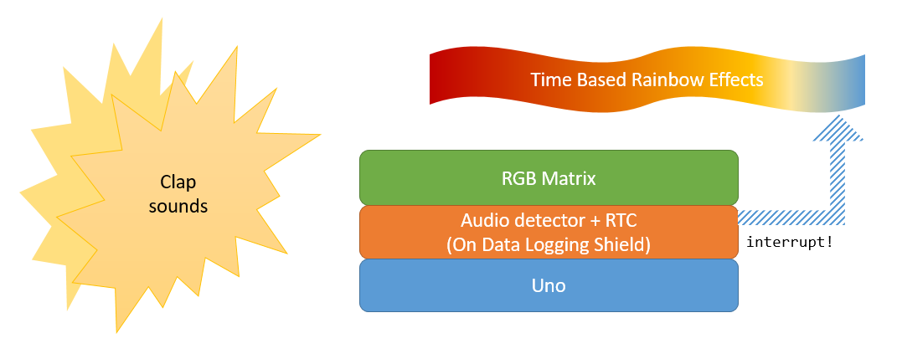
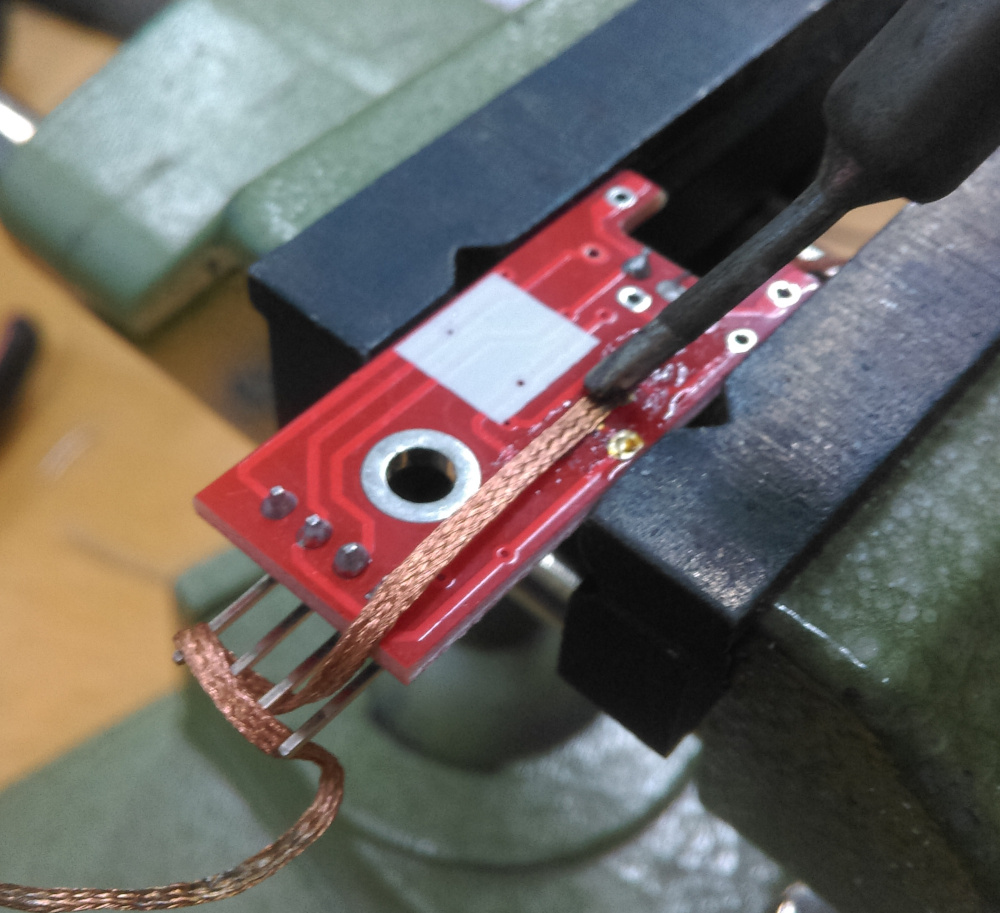
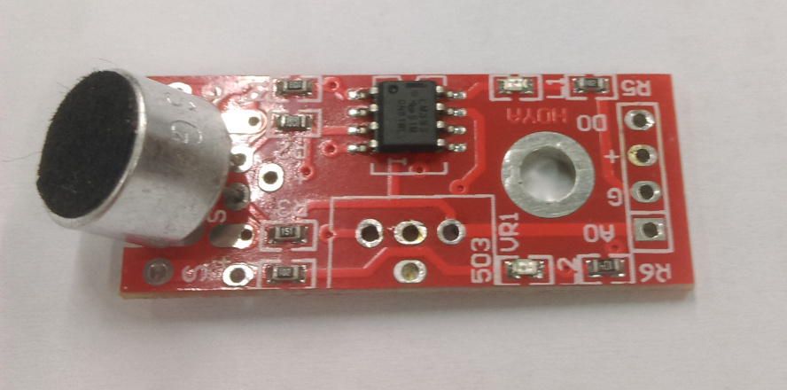
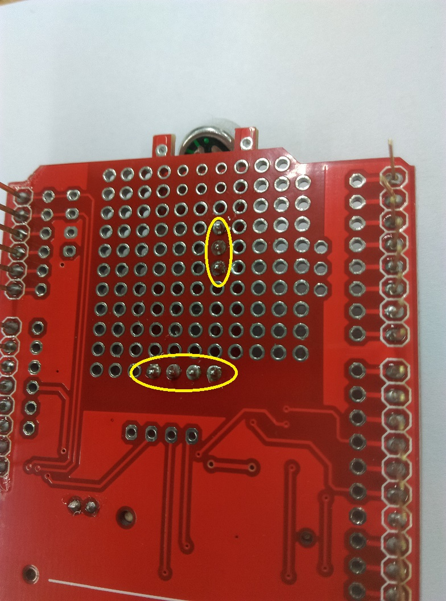
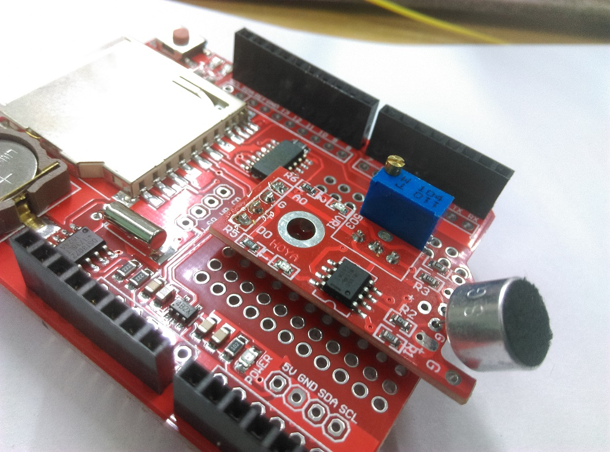
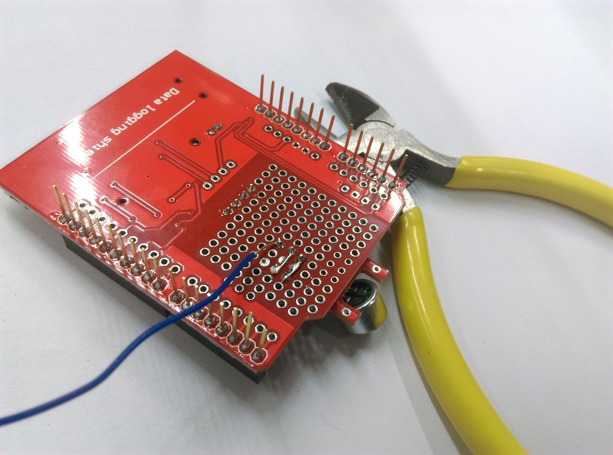
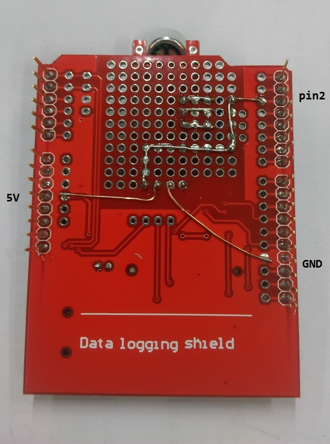

# Silent Alarm Clock

Do you need an alarm clock that doesn't wake anyone up next door? Do you often look at the time and immediately fall asleep again? Well look no further with this silent alarm clock project! Uses our new RGB LED shield to provide a great colourful display in your room to simulate daylight and gently wake your body up;

If you want to know what time it is, just give two loud claps and the Silent alarm clock will give you a readout of the current time to give your brain a quick morning jog.


| Input | Output     |
| ----- | ---------- |
| Time  | RGB Colour |
| Claps | Time       |

## Bill of Materials

| Qty | Code             | Description             |
| --- | ---------------- | ----------------------- |
| 1   | [XC4410][xc4410] | Arduino Uno             |
| 1   | [XC4536][xc4536] | Datalogging Shield      |
| 1   | [XC3730][xc3730] | 8x5 RGB Shield          |
| 1   | [XC4438][xc4438] | Microphone Sound Module |

### Look around your workbench for

- Spare headers ([HM3211](https://jaycar.com.au/p/HM3211))
- Solid Core wire ([WH3032](https://jaycar.com.au/p/WH3032))
- Desolder Wick, Pump, Isopropyl (for cleaning), ([NS3026](https://jaycar.com.au/p/NS3026),[TH1862](https://jaycar.com.au/p/TH1862),[NA1060](https://jaycar.com.au/p/NA1060) )

## System overview



This is a simple "clock" type of device that will change the colour of the shield depending on the time; At night it will be more red, allowing you to sleep; But in the morning it will be more whitish-blue, to gently wake you up;

It will also have a clap-detector built into it; so when you clap twice (*think: "the clapper"*) The device outputs what time it is on the RGB Matrix in a nice yellow colour.

Naturally, when the system detects the claps, it will interrupt the "rainbow" effects to display the time in a straight-forward manor.

## Sound Sensor modifications

Firstly you will want to remove and clean up the pins and the blue pot on the module so that it can fit under the shield. The pins can be straightened out with a pair of pliers, then use the technique mentioned in the <https://jaycar.com.au/removing-headers> tutorial.



The potentiometer is a little different: you should be able to heat up 2 pads at once, pulling out that side of the potentiometer and gently "wiggling" it out of the PCB. Use plenty of solder wick ([NS3026](https://jaycar.com.au/p/NS3026)) or you can try your hand with a solder sucker ([TH1862](https://jaycar.com.au/p/TH1862)) to remove the solder. *Tip: you might find it easier to apply fresh solder to the pad.*



Once the audio module does not have pins or the potentiometer on it; use some spare headers (or small wires) to mount the module to the datalogger shield; We've outlined where you want to place the headers, but you can put them anywhere you want *(if you want to have a buzzer or other improvements down the line, be sure to leave space; we've placed this in the centre just out of simplicity)*.



You'll find that this layout allows the audio module to be mounted on top very nicely; you can then solder on the audio module and put the poteniometer in place right next to it.



This effectively just moves the potentiometer across and lower so it can fit under the shield; electrically it all works out the same once you connect it to the header pins:



Use some solid core wires to connect the `+` and `GND` connections, as well as `D0` to `Pin 2` on the arduino; D0 is going to be our clap detection, which we wire to `Pin 2` so that it can trigger an interrupt.



## Integration

First use the `calibrate.ino` sketch to set up the RTC and test the clapper. Use a small screwdriver on the blue poteniometer so that when you make a loud noise (like a clap), the LED will be on for a short while. Follow the instructions in the Serial Monitor for more information.

When you upload `calibrate.ino` The sketch will adjust the rtc to be the same as the computer time the moment you press upload. Each reset you do will adjust it to the same time and date.

When you are happy with the calibration results, it is generally a good idea to **upload the sketch again** so that it correctly adjusts the time; Then you can open up and upload the `clock.ino` so that it does not change the time again. When we upload the `clock.ino` sketch, it removes the `rtc.adjust` so that there is no more adjusting and the rtc happily ticks away at the correct time.

## Use

Simply observe, and clap twice; you should find that it outputs the time onto the LED matrix.

## Source Code

The source code is simple enough; with the basic `setup()` and `loop()` functions below:

```cpp
void setup()
{
  // put your setup code here, to run once:
  Serial.begin(9600);
  shield.begin();
  shield.setBrightness(100);

  pinMode(pin_sensor, INPUT);
  pinMode(pin_buzzer, OUTPUT);

  //we define the "detectClaps" function in the sketch
  attachInterrupt(digitalPinToInterrupt(pin_sensor),detectClaps, RISING);

  setupRTC();
}

void loop(){
  DateTime realTimeNow = rtc.now();
  // ... 

  //always display colour on the matrix, corresponding to time
  setColourFromTime(realTimeNow);

  if (hasClapped){
    //we have detected two claps, print in "hh:mm" format
    shield.print(realTimeNow.toString("hh:mm"));
  }
}

```

The `setColourFromTime()` function is simply a collection of if-statements to block off portions of the day: 

```cpp
if(hours < morningTime)
{
  // between 0 -> 6am
  // change from red to whitish blue to wake up
}
else if (hours > morningTime && hours < afternoonTime)
{
  // 6am -> 4pm
  // show mainly blue, some white, etc
}

// etc
```

Then while we're doing this, the detect claps function is a simple interrupt that will check for 2 claps in a reasonable time frame; We "debounce" the claps so that any ringing effects aren't mis-counted as a second clap.

```cpp
//fired any time the audio module detects noise
void detectClaps()
{
  unsigned long timeNow = millis();

  if (firstClapTime == 0)
  {
    firstClapTime = timeNow;
    return;
  }

  unsigned long duration = timeNow - firstClapTime;

  if (duration > clap_debounce_ms && duration < clap_delay_ms)
  {
    //two claps genuine; set clapped flag
    firstClapTime = 0;
    hasClapped = true;
  }
  else if (duration > clap_delay_ms)
  {
    //timeout.. took too long
    firstClapTime = 0;
  }
}
```

We have also included a `#define TIMELAPSE` comment which you can comment out to test what it will look like over the course of a whole day. If you uncomment this define it will rapidly move through the time in the day and output the time in Serial.

## Further Reading

- <https://www.livescience.com/53874-blue-light-sleep.html>
- <https://justgetflux.com/>
- <https://learn.adafruit.com/adafruit-neopixel-uberguide/neomatrix-library>

[xc4410]: https://jaycar.com.au/p/XC4410
[xc4536]: https://jaycar.com.au/p/XC4536
[xc3730]: https://jaycar.com.au/p/XC3730
[xc4438]: https://jaycar.com.au/p/XC4438
